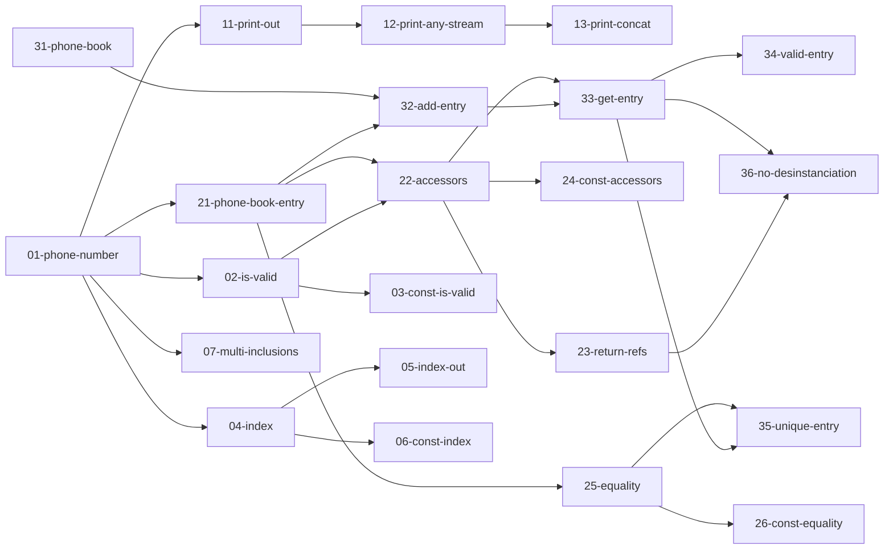

# TP04 - Révisions

## AVERTISSEMENT

Ce TP est une préparation au TP noté.  Il est donc configuré pour fonctionner sur les machines de l'université et pourrait ne pas fonctionner correctement sur d'autres systèmes.

## Objectifs

- Découvrir les conditionts des TPs notés
- Lancer les tests unitaires
- Revoir les différentes notions du cours


Voir le fichier `TPNode.md` qui décrit le fonctionnement des TP notés. Il est conseillé de se mettre dans les bonnes conditions pour vous entraîner.

## Dans le TP04

### Exercice 1 - Vrai ou Faux (20 min)

Le premier exercice est un vrai ou faux.

Ouvrez le fichier [ex1/src/qcm.hpp](ex1/src/qcm.hpp).  
Vous devez indiquer pour chaque proposition si celle-ci est vraie (`true`) ou fausse (`false`).  
Lors du TP noté, une réponse incorrecte peut vous retirer des points, donc laissez le champ vide si vous ne savez pas.

Par exemple, si je sais que Victor a les cheveux courts, mais qu'on ne sait pas si Céline a les cheveux longs, :
```cpp
// Question 1
// Victor a les cheveux longs.
#define ANSWER_1 false

// Question 2
// Céline a les cheveux longs.
#define ANSWER_2
```

Si vous exécutez `./run_tests.sh ex1`, le test associé deviendra vert dès lors que vous aurez répondu à toutes les questions (même si vous avez mal répondu).


### Exercice 2 - Implémentation d'un répertoire téléphonique (60min)

Dans ce type d'exercice, vous devez coder différentes classes et fonctions afin de faire passer les tests unitaires fournis.  
Avec le framework Catch2, les tests unitaires ont la forme suivante :
```cpp
TEST_CASE("Titre du test")
{
  // Des instructions...
  REQUIRE(/** une assertion **/);

  // D'autres instructions...
  REQUIRE(/** une autre assertion **/);
}
```
Dans un premier temps, il faut réussir à implémenter le code permettant au test de **compiler**.  
La seconde étape est d'adapter ce code afin qu'**il se comporte comme attendu** (c'est-à-dire que les conditions spécifiées dans les `REQUIRE` s'évaluent à `true`).

Ouvrez le premier fichier de tests [ex2/tests/01-phone-number.cpp](ex2/tests/01-phone-number.cpp).  
Le but est de définir une classe `PhoneNumber`, qui servira à représenter un numéro de téléphone.  
Ajoutez le fichier requis par le test et implémentez son contenu.

Une fois que vous pensez avoir terminé, utilisez `./run_tests.sh ex2-01` pour compiler et exécuter ce premier test.  
Si vous avez réussi à le faire passer, passez au test suivant.

#### Dépendances

Certains tests sont dépendants les uns des autres.  Inutile d'essayer de faire un test dont vous n'avez pas réussi un des prérequis.  
Le graphe ci-dessous vous indique les dépendances en question.


(Pour que le graphe ci-dessus s'affiche correctement dans le preview VSCode, installez l'extension *Markdown Preview Mermaid Support*.)

#### Conseils

1. Attention aux régressions ! Relancez régulièrement l'intégralité des tests de l'exercice avec `./run_tests.sh ex2` pour vous assurez que vos dernières modifications n'ont pas cassé un test qui passait précédement.
2. Ne restez pas bloqué trop longtemps sur la même question. La plupart des tests sont indépendants, donc n'hésitez pas à avancer et à revenir sur ceux qui vous posaient problème s'il vous reste du temps à la fin de la séance.

## Exercice 3 - Code à trous (20min)

Le dernier type d'exercice est un texte à trou, mais avec du code.
Vous devez donner une valeur à chacune des constantes `ANSWER_X` de manière à faire en sorte que le test passe.
Notez que parfois, la bonne réponse est "rien". Laissez alors la valeur de la constante vide.

Dans ce genre d'exercice, les tests vous indiquent si le code compile, mais pas forcément si vos réponses sont bien celles attendues.

Par exemple, pour le test [ex3/tests/01-types.cpp](ex3/tests/01-types.cpp), on attend que vous trouviez le prototype (type de retour et types des paramètres) optimal pour chacune des déclarations de fonctions.  
Si le test passe, cela signifie simplement que vos réponses permettent au code de compiler, pas nécessairement que vous avez utilisé les bons types.
